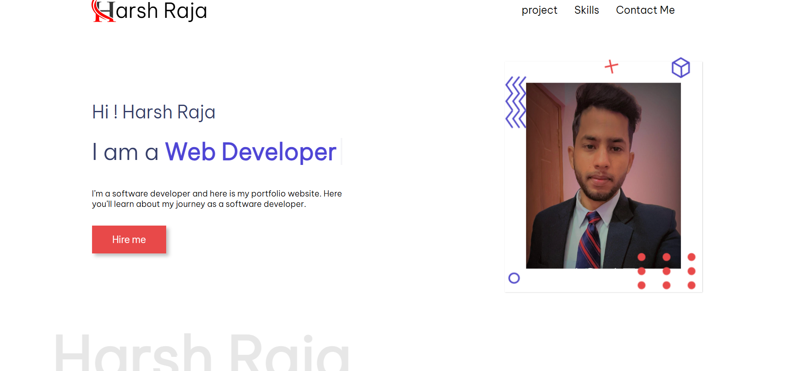

# 🌐 Personal Portfolio Website

[website Link](https://harshraja45.github.io/portfolio_website2/)

This is my **personal portfolio website** created using only **HTML** and **CSS**.
It showcases my skills, projects, and a little about me as a developer.

---

## ✨ Features
- Responsive design for desktop and mobile
- Clean and modern UI using pure CSS
- Sections for **About Me, Skills, Projects, and Contact**
- Smooth navigation and simple layout
- Minimalist design without any frameworks

---

## 🛠️ Technologies Used
- **HTML5**
- **CSS3**

---

## 📂 Project Structure
Portfolio/
│── index.html
│── style.css
│── images/ (profile + project images)
│── favicon/ (website icon)

yaml
Copy
Edit

---

## 📸 Screenshots

